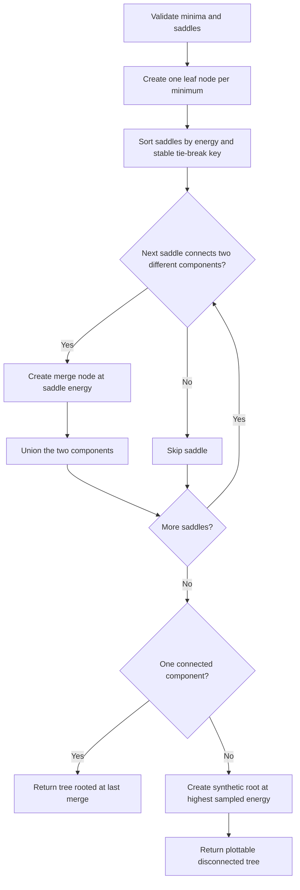

<p align="center">
  
</p>

# DisconnectivityGraphs.jl

Generic Julia tools for building disconnectivity trees from minima-transition
state networks. The package is intended to support micromagnetic energy
landscapes from Merrill.jl/NEB workflows, while keeping the core data model
usable for other systems.

The current package skeleton includes:

- typed `Minimum`, `Saddle`, and `LandscapeGraph` containers;
- validation of endpoint consistency and duplicate minima;
- an exact Kruskal-style merge-tree builder;
- energy-threshold component partitions for algorithm checks.
- backend-independent tree layout segments for interactive/static plotting.

## Development Example

```julia
using DisconnectivityGraphs

minima = [Minimum(:A, 0.0), Minimum(:B, 1.0), Minimum(:C, 3.0)]
saddles = [Saddle(:A, :B, 5.0), Saddle(:B, :C, 8.0)]
landscape = LandscapeGraph(minima, saddles)

tree = disconnectivity_tree(landscape)
component_partition(landscape, 6.0)
```

## Algorithm Sketch

The core tree builder is a union-find merge algorithm over the sampled
minimum-saddle network. In implementation terms, every minimum starts as its own
leaf node, saddles are processed from low to high energy, and every saddle that
first connects two previously disconnected components creates one new internal
tree node.



Operationally, the algorithm keeps three parallel pieces of state for each
current connected component:

- the union-find representative used for fast connectivity checks;
- the current tree node that represents that component in the output tree;
- the list of minima already contained in that component.

That is why the algorithm is efficient and exact for the sampled graph: it does
not search a dense energy surface, it only asks when the sparse transition
network first becomes connected as the allowed saddle energy rises.

## Micromagnetic Direction

The first Merrill.jl-facing adapter should ingest the multistate outputs in
`PINT_with_reversal/code/reversal_paleointensity_probability/fabian05_results`:

- basis/state tables as minima with energies, net moments, and mesh metadata;
- all-pair NEB summaries/profiles as saddle records;
- field-adjusted barriers and relaxation-time matrices as parallel views of the
  same network.

See `roadmap.md` for the execution plan.

## Interactive Notebooks

The `examples/` folder contains PlotlyJS notebooks with synthetic
micromagnetic-style landscapes. They are meant to exercise the package API and
visualization direction without requiring Merrill.jl minimization or NEB runs.

## Documentation

The `docs/` folder contains a Documenter.jl website. Its GitHub Actions workflow
executes the notebooks in `examples/` and deploys the rendered HTML alongside
the conceptual guide and API reference.
